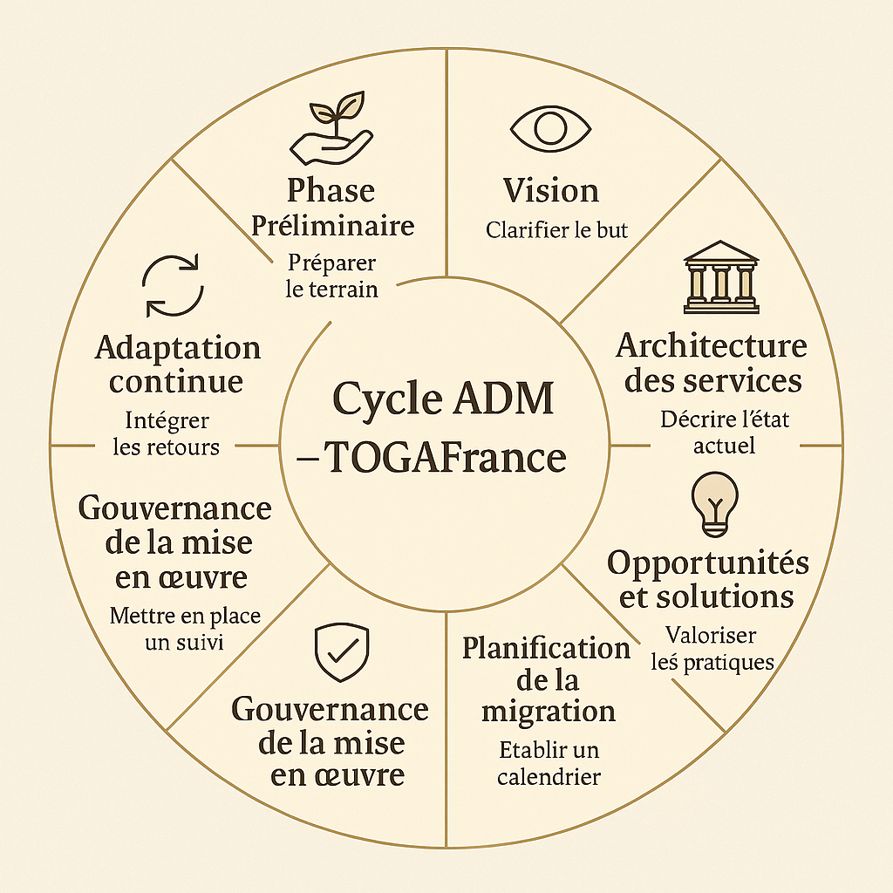

# TOGAFrance – Chapter 3: The Method

_French version available here: [03-method-FR.md](./03-method-FR.md)_

---

## Why a Method?

Too many reforms in France have failed for lack of method.  
They stack up, contradict each other, or remain disconnected from real life.

**TOGAFrance is not another reform. It is a method.**  
A method for rebuilding, not just reorganizing.  
A method to restore meaning, not to add administrative layers.  
A method that helps territories act with coherence, clarity, and humanity.

---

## Methodological Foundations

TOGAFrance is inspired by the TOGAF framework (The Open Group Architecture Framework), widely used in systemic transformations.  
It has been adapted to the French context to serve the common good — not corporate interests.

Its key principles:

- **A clear, shared, evolving vision**
- **A modular architecture**, centered on actual needs and relationships
- **Participatory governance**, with meaningful local contributions
- **Tools that are simple, documented, and reusable**
- **Freedom to deviate**, when justified and documented
- **Human-centered indicators**, valuing impact over procedures

> The method is designed for everyone — public agents, citizens, territories — not just experts.

---

## 🌀 TOGAFrance ADM Cycle

The TOGAFrance method adapts the classic TOGAF ADM into a **human-centered, iterative cycle**.  
Each phase serves a clear purpose and leaves tangible, shareable deliverables.  
Here is how TOGAFrance interprets the key steps of the cycle:

---

### 1. Preliminary Phase – *Prepare the ground*  
Identify key actors, clarify intentions, and ensure ethical alignment.  
Build trust, define what “success” means, and prepare for open collaboration.

### 2. Vision – *Clarify the purpose*  
Define a shared direction: why are we acting? What future are we aiming for?  
Keep it simple, inspiring, and understandable by all (including a 10-year-old).

### 3. Service Architecture – *Describe the current state*  
Map existing services, actors, needs, and dysfunctions.  
Create a shared image of “how things work today.”

### 4. Opportunities & Solutions – *Recognize good practices*  
Highlight what already works locally.  
Spot small victories and amplify them.

### 5. Migration Planning – *Create a clear roadmap*  
Design a realistic sequence of actions, with human-centered milestones.  
Use catalogs, role matrices, and reversibility as structuring tools.

### 6. Implementation Governance – *Support the process*  
Set up tools for local monitoring, coordination, and ethical guidance.  
Give each actor a clear, useful role.

### 7. Implementation Monitoring – *Track what happens*  
Gather feedback from the field.  
Celebrate successes, and identify mismatches between plan and reality.

### 8. Continuous Adaptation – *Learn and improve*  
Document lessons learned.  
Update the architecture and share it openly, so others can learn from your path.

---

📝 Each phase is **reversible, co-constructive, and documented**.  
A territory can pause or restart a phase if the human link is broken.  
The cycle doesn’t impose — it supports.  

👉 This structure helps align local action with national coherence, without killing creativity.

---

## Deliverables: The Content Framework

TOGAFrance reuses the TOGAF Content Framework to organize deliverables, simplified as follows:

| Phase         | Example Deliverables                          |
|---------------|-----------------------------------------------|
| Vision        | Mission Statement, Ethics Charter             |
| Diagnosis     | Need Matrix, User Journey Maps                |
| Action Plan   | Action Roadmap, Risk Table, Budget Draft      |
| Experiment    | Test Sheets, Impact Logs, Consent Forms       |
| Feedback      | Experience Reports, Learning Sheets           |

Each deliverable is:

- Named and dated
- Archived publicly (via GitHub or local wiki)
- Written in plain language
- Designed for reuse by others

---

## Roles and Responsibilities

TOGAFrance is not hierarchical. Roles are based on usefulness, not titles.  
Here are some example roles:

- **The Bridge-Builder**: bridges citizens and institutions  
- **The Guardian**: ensures ethical principles are respected  
- **The Watcher**: observes weak signals and risks  
- **The Builder**: organizes tools and coordination  
- **The Weaver**: connects isolated actors and initiatives  

Each role may shift or overlap, depending on the local team. A **role matrix** is provided to visualize who contributes where during the cycle.

---

## What the Method Rejects

- Centralized rigidity and imposed norms  
- Software disconnected from human reality  
- Abstract KPIs without qualitative meaning  
- Pretending to innovate without involving people  
- Confusing reform with transformation

---

## What the Method Enables

- Local pilots who adapt TOGAFrance and share their lessons  
- Citizens and agents acting together, with simple tools  
- Territories regaining confidence and initiative  
- A growing **commons** of living documentation  
- A memory of what was tried, learned, or abandoned

---

## Technical and Structural Tools

- **GitHub repository**: versioned, open-source, participatory  
- **Templates and checklists**: for diagnostics, action plans, feedback  
- **Markdown format**: preferred for portability and simplicity  
- **Issues and pull requests**: enable non-technical contributions  
- **Contribution Guide**: [CONTRIBUTING.md](../CONTRIBUTING.md)

> Not a developer? You can translate, test, share, suggest, or link people. Every voice counts.

---

## To Go Further

- [Glossary](./08-glossary.md) — Key terms (e.g., catalog, role matrix, reversibility)
- [FAQ](./09-faq.md) — Questions about how to contribute or adapt the method
- [Live Examples](../pilots-territories/) — Territory pilots and shared experiences
- [Templates](../tools/templates/) — To help you get started

---

> The method is open, reversible, and alive.  
> You don’t need permission to start. You just need to respect the compass.  
> If you make it better, we all grow.

---

*Next chapter: [04-for-whom.md](./04-for-whom.md)*
